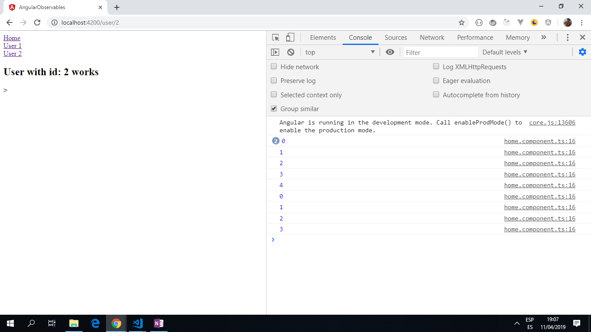

# :zap: Angular Observables

* This project uses the Observables in Angular to stop a process by using ngOnDestroy to avoid memory leak if a page process is left running when the web page is exited.
* **Note:** to open web links in a new window use: _ctrl+click on link_


## :page_facing_up: Table of contents

* [:zap: Angular Observables](#zap-angular-observables)
  * [:page_facing_up: Table of contents](#page_facing_up-table-of-contents)
  * [:books: General info](#books-general-info)
  * [:camera: Screenshots](#camera-screenshots)
  * [:signal_strength: Technologies](#signal_strength-technologies)
  * [:floppy_disk: Setup](#floppy_disk-setup)
  * [:computer: Code Examples](#computer-code-examples)
  * [:cool: Features](#cool-features)
  * [:clipboard: Status & To-Do List](#clipboard-status--to-do-list)
  * [:clap: Inspiration](#clap-inspiration)
  * [:envelope: Contact](#envelope-contact)

## :books: General info

"The observer pattern is a software design pattern in which an object, called the subject, maintains a list of its dependents, called observers, and notifies them automatically of any state changes, usually by calling one of their methods. It is mainly used to implement distributed event handling systems. Observables, help JavaScript as a language integrate the observer design pattern."

## :camera: Screenshots

.

## :signal_strength: Technologies

* [Angular v12](https://angular.io/)
* [RxJS Library v6](https://angular.io/guide/rx-library) used to handle datastreams and propagation of change using observables.

## :floppy_disk: Setup

* Install dependencies using `npm i`
* Run `ng serve` for a dev server.
* Navigate to `http://localhost:4200/`. The app will automatically reload if you change any of the source files

## :computer: Code Examples

```typescript
import { Component, OnInit, OnDestroy } from '@angular/core';
import { interval, Subscription } from 'rxjs';

@Component({
  selector: 'app-home',
  templateUrl: './home.component.html',
  styleUrls: ['./home.component.sass']
})
export class HomeComponent implements OnInit, OnDestroy {
  subscription: Subscription;

  constructor() { }

  ngOnInit() {
    const myNumbers = interval(1000);
    this.subscription = myNumbers.subscribe(val => console.log(val));
  }

  // stop counting when user leaves the page
  ngOnDestroy() {
    this.subscription.unsubscribe();
  }
}

```

## :cool: Features

* When the user clicks on the 'Home' link the counter starts counting up every second. If the user clicks on 'User 1' or 'User 2' then the counting stops. This demonstrates that the Angular function`ngOnDestroy()` is working correctly.
* Updated to use latest Angular 11, all dependencies updated with no vulnerabilities.

## :clipboard: Status & To-Do List

* Status: Working. Updated may 2021.
* To-Do: This could be used as a sand-box to try out other angular functionality.

## :clap: Inspiration

* [CodingandCaffeine: Angular RxJS Observables. Understanding the approach](https://www.youtube.com/watch?v=R7Y8k8mHEeA).

## :file_folder: License

* This project is licensed under the terms of the MIT license.

## :envelope: Contact

* Repo created by [ABateman](https://github.com/AndrewJBateman), email: gomezbateman@yahoo.com
